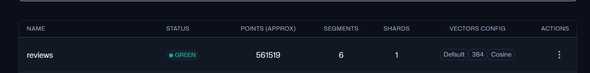
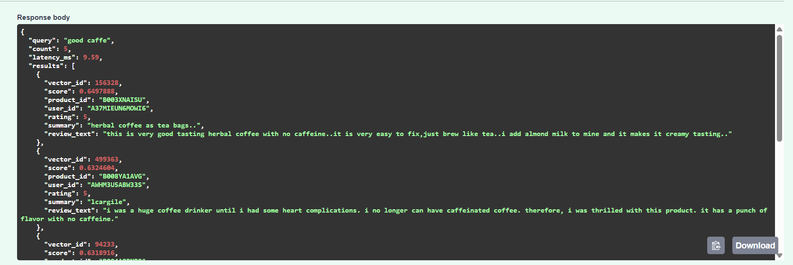

# AI-Ready Review Pipeline

This project processes 500k+ Amazon reviews using a PySpark medallion pipeline (`raw -> bronze -> silver -> gold`) and produces two outputs:
- Power BI-ready analytics tables
- Semantic search on Qdrant

### 1) Analytics
`raw -> bronze -> silver -> gold/analytics`

Power BI-ready output tables:
- `data/gold/analytics/product_summary`
- `data/gold/analytics/monthly_review_summary`
- `data/gold/analytics/rating_distribution`

### 2) Search
`gold/reviews -> embeddings -> Qdrant -> search API`

Search components:
- `scripts/gold_layer.py` (builds `gold/reviews`)
- `scripts/embedding_layer.py` (generates embeddings to `data/embeddings`)
- `vector/load_full_to_qdrant.py` (loads vectors into Qdrant)
- `api/search_api.py` (`/health`, `/search`)

Embedding model used:
- `sentence-transformers/all-MiniLM-L6-v2` (384 dimensions)

### 3) Semantic Search Demo

Qdrant collection status:

Semantic search API example (`POST /search`):

No additional database is required for Power BI in the MVP.  
Gold parquet outputs can be consumed directly.
